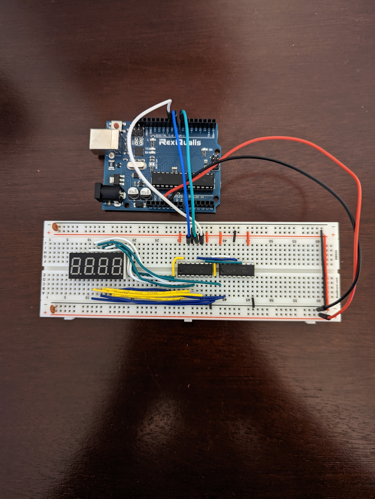
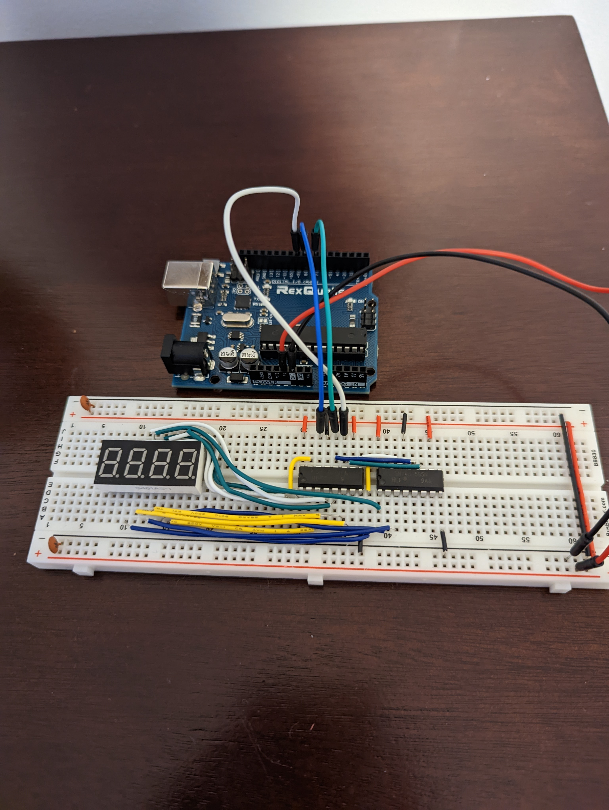
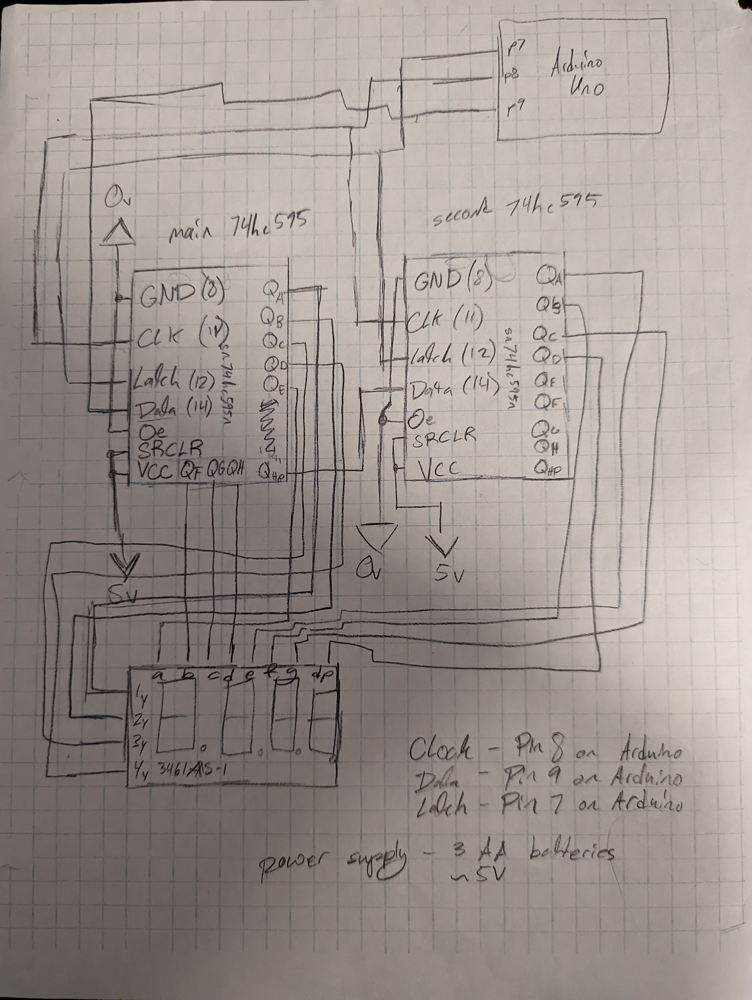

# Have a Great Day
 arduino, 3461as-1 led display, and sn74hc595n (2) shift register project

i used a 5v battery

no math was done in the making of this project

this is a project i spent a day on. i made it from scratch without any libraries (then implemented FastShiftOut.h, credits to RobTillaart). i tried my best to document it, if theres any issues contact me (somehow).

it basically renders each led in order faster than the human eye can see, based on an array of 4 integers. decently optimized

spare me for this crappy schematic, i made it after i finished the project lol i learned my lesson.

for those also young: if a 14yo kid can make something like this, you can obviously make bigger- make better. dont feel demotivated, it took a long time to get to where i am, its not a trivial process.
